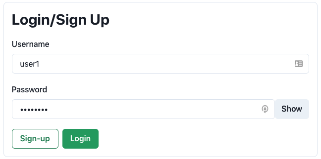
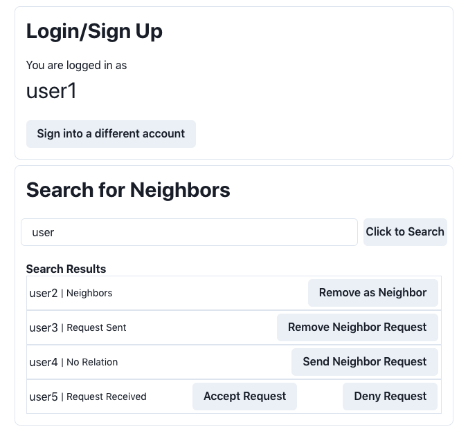
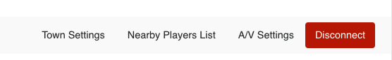
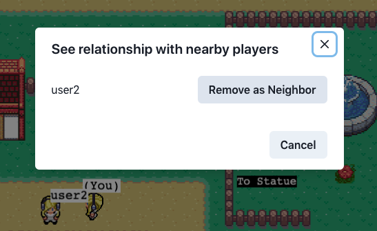

# Features

## Profile - Signing Up and Logging In

The first feature that has been added is the ability to sign up for a profile and log in during future uses. On the 
initial page, the "Your name" input has been modified and now asks for a username and password. Once the user has 
inputted these values, they can click Sign-Up (if this is their first time) or Login.

Note: We are enforcing unique usernames, so two users cannot have the same username. 

## Searching for and Adding Neighbors

#### Searching for Users
After a user logs in or signs up, they can search for other users and add them as "neighbors". This is as simple as
typing a username in the search bar and pressing enter/hitting the "Click to Search" button.

If a user is found with that exact username, that will be the only result, but otherwise, we will return all users with
names starting with the search query. In the example below, all users with "user" in their username will be included in
the search results (except the user searching).

There are 4 possible relationships to other users:
1. Unknown (No Relation) - you do not know this user, you can send a "Neighbor Request"
2. Request Sent - you sent a request, and the other user has not responded yet
3. Request Received - you received a request from the user, and have not yet responded (either Accept or Deny)
4. Neighbors - you are already neighbors, but you can remove this user as your neighbor

#### In Game 
While in a game, a user can look at their relationship with nearby players by clicking "Nearby Players List" in the bottom
right corner of the screen, next to the town settings.

This will bring up a list of nearby players and allows the user to send a neighbor request, remove a neighbor, etc, in a
manner similar to the pre-game search box.

#### User Account Page
Users will also be able to open a modal after logging in that shows all their account information such as their open
neighbor requests, and they will be able to respond to these requests (Accept/Deny). Additionally, they will have access
to a table of all their online neighbors and be able to join their towns. This will be explained next.

## Interacting with Neighbors
