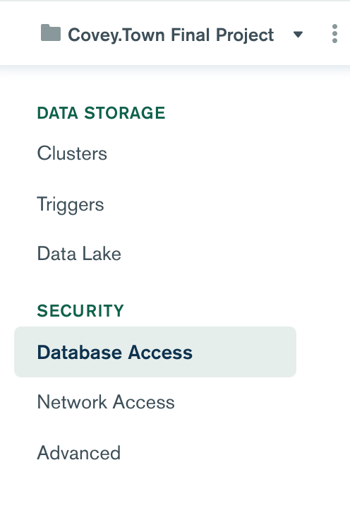
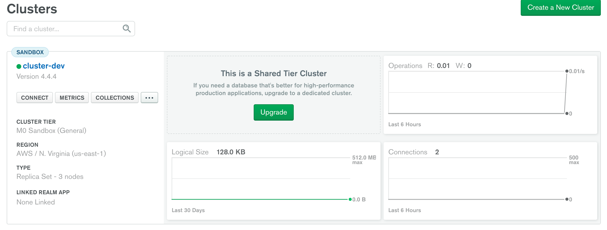
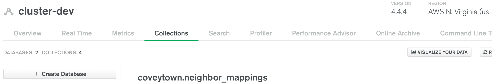
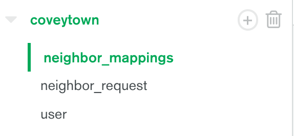
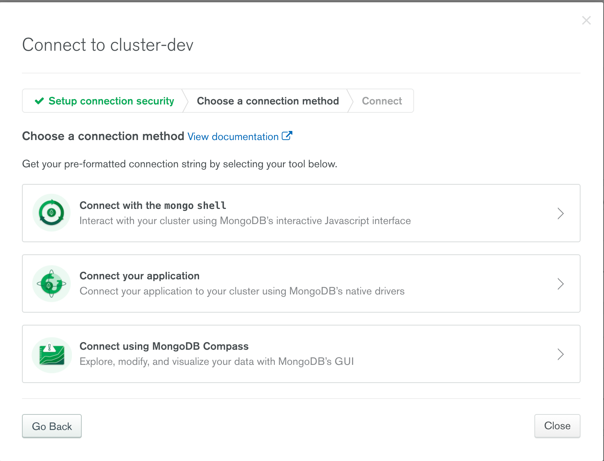

# Covey.Town - [Repo is here](https://github.com/zefwang/covey.town)

Covey.Town provides a virtual meeting space where different groups of people can have simultaneous video calls, allowing participants to drift between different conversations, just like in real life.
Covey.Town was built for Northeastern's [Spring 2021 software engineering course](https://neu-se.github.io/CS4530-CS5500-Spring-2021/), and is designed to be reused across semesters.
You can view our deployment of the app [here](https://adoring-nobel-447f23.netlify.app/).

The figure above depicts the high-level architecture of Covey.Town.
The frontend client (in the `frontend` directory of this repository) uses the [PhaserJS Game Library](https://phaser.io) to create a 2D game interface, using tilemaps and sprites.
The frontend implements video chat using the [Twilio Programmable Video](https://www.twilio.com/docs/video) API, and that aspect of the interface relies heavily on [Twilio's React Starter App](https://github.com/twilio/twilio-video-app-react).

A backend service (in the `services/roomService` directory) implements the application logic: tracking which "towns" are available to be joined, and the state of each of those towns.

## Running this app locally

Running the application locally entails running both the backend service and a frontend.

### Setting up the backend

To run the backend, you will need a Twilio account. Twilio provides new accounts with $15 of credit, which is more than enough to get started.
To create an account and configure your local environment:

1. Go to [Twilio](https://www.twilio.com/) and create an account. You do not need to provide a credit card to create a trial account.
2. Create an API key and secret (select "API Keys" on the left under "Settings")
3. Create a `.env` file in the `services/roomService` directory, setting the values as follows:

| Config Value            | Description                               |
| ----------------------- | ----------------------------------------- |
| `TWILIO_ACCOUNT_SID`    | Visible on your twilio account dashboard. |
| `TWILIO_API_KEY_SID`    | The SID of the new API key you created.   |
| `TWILIO_API_KEY_SECRET` | The secret for the API key you created.   |
| `TWILIO_API_AUTH_TOKEN` | Visible on your twilio account dashboard. |

### Creating and Connecting to MongoDB

With our addition of CoveyTown Neighbors, you will need a MongoDB account as well. MongoAtlas offers free accounts and cloud hosting for MongoDB instances at https://www.mongodb.com/cloud/atlas. After creating an account, MongoAtlas will automatically create a cluster for you. Choose all the free tier options, no need to upgrade to anything. While your clustering is launching, lets configure the permissions and access for your MongoDB instance. On the left hand menu, click Network Access. 

Click '+ Add IP Address' on the right side of the window and add '0.0.0.0/0' to whitelist all IP addresses, or you can add only your IP address. Save and navigate to Database Access to create a database user to access your MongoDB instance.

Enter any username and password you'd like but ensure that you set the permissions to read and write to any database. Save this information for later. Now our cluster should be up and running so let's navigate back to 'Clusters' on the side menu to create our database and collections. On your cluster, click 'Collections'. 

Click 'Create Database' and enter 'coveytown' for the database name and 'user' for the first collection. 

After your database is created, create two additional collections, 'neighbor_request' and 'neighbor_mapping' by pressing the '+' sign next to your database. 

The last thing that we need to do is connect our application to the database. Go back to 'Clusters' page in your console and click 'CONNECT' on your cluster. Select 'Connect your application'. Choose your node version and copy the URI that is in the example code. Replace `<password>` in the URI with your database user's password from earlier. 

Copy the URI into your `.env` file with the Twilio credentials as follows:

| Config Value            | Description                               |
| ----------------------- | ----------------------------------------- |
| `MONGO_URL`             | URI to connnect to your MongoDB instance. |

The last thing you'll need to do to connect to your MongoDB instance is to whitelist your IP address. 

### Starting the backend

Once your backend is configured, you can start it by running `npm start` in the `services/roomService` directory (the first time you run it, you will also need to run `npm install`).
The backend will automatically restart if you change any of the files in the `services/roomService/src` directory.

### Configuring the frontend

Create a `.env` file in the `frontend` directory, with the line: `REACT_APP_TOWNS_SERVICE_URL=http://localhost:8081` (if you deploy the rooms/towns service to another location, put that location here instead)

### Running the frontend

In the `frontend` directory, run `npm start` (again, you'll need to run `npm install` the very first time). After several moments (or minutes, depending on the speed of your machine), a browser will open with the frontend running locally.
The frontend will automatically re-compile and reload in your browser if you change any files in the `frontend/src` directory.
